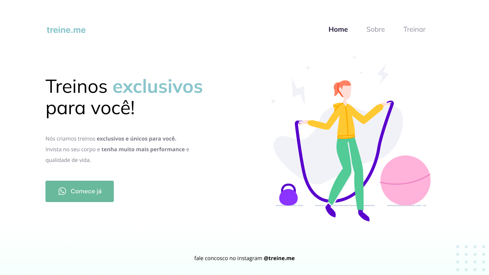

<h1 align="center">Treine me</h1>

  <a href="#projeto">Projeto</a>&nbsp;&nbsp;&nbsp;|&nbsp;&nbsp;&nbsp;
  <a href="#tecnologias">Tecnologias</a>

---

## Projeto

Nesse desafio, você receberá um código com o projeto desenvolvido durante as aulas da Fase 02. O código sofreu algumas alterações e ele não está mais da mesma forma que foi deixado nas aulas.

Você deve deixar o site da mesma cara que antes.

    

---

## Tecnologias

Esse projeto foi desenvolvido utilizando as seguintes tecnologias:

- HTML
- CSS
