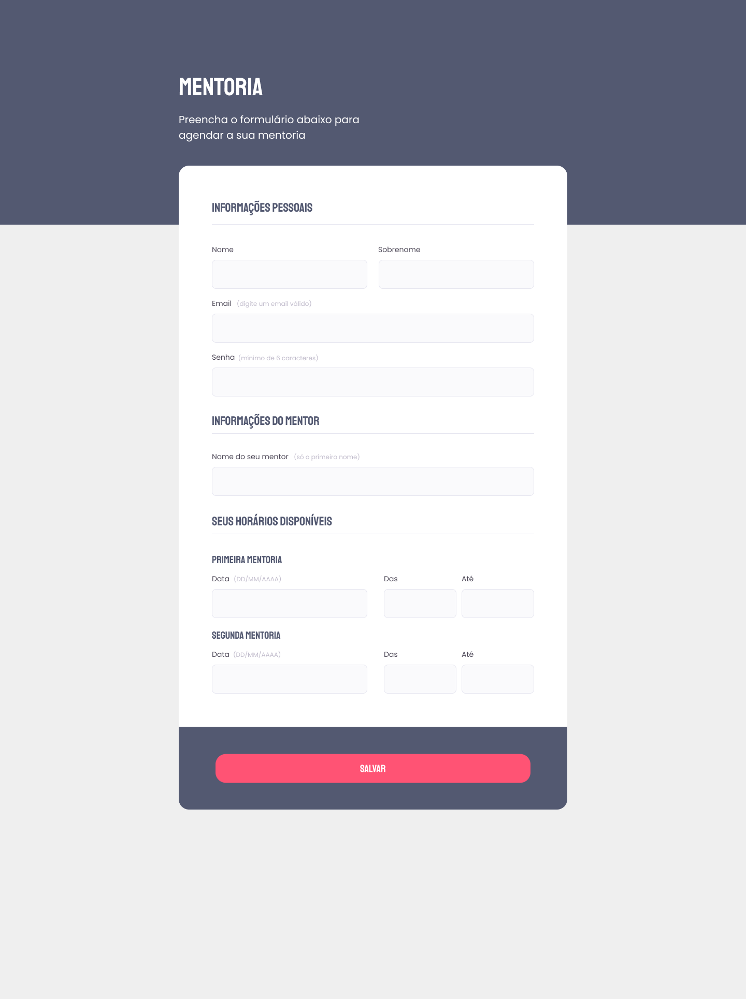

<h1 align="center">Formulário de Mentoria</h1>

  <a href="#projeto">Projeto</a>&nbsp;&nbsp;&nbsp;|&nbsp;&nbsp;&nbsp;
  <a href="#tecnologias">Tecnologias</a>

---

## Projeto

Página desenvolvida para que você envie seu formulário contendo as informações, necessidades e objetivos da mentoria.

    

---

## Tecnologias

Esse projeto foi desenvolvido utilizando as seguintes tecnologias:

- HTML
- CSS
