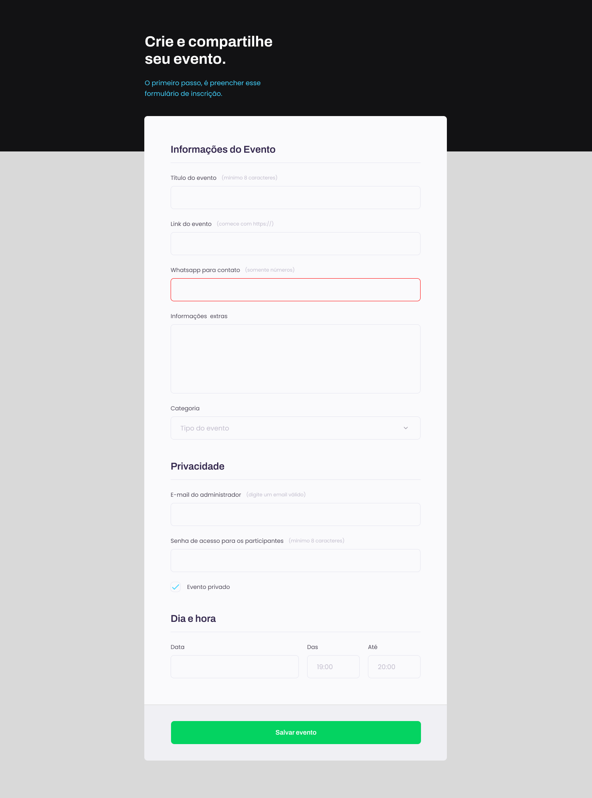

<h1 align="center">Crie seu evento</h1>

  <a href="#projeto">Projeto</a>&nbsp;&nbsp;&nbsp;|&nbsp;&nbsp;&nbsp;
  <a href="#tecnologias">Tecnologias</a>

---

## Projeto

Esta página foi desenvolvida para permitir que você crie o seu próprio evento. Através do formulário, você poderá fornecer os detalhes necessários e garantir que seu evento seja organizado de acordo com suas preferências.

    

---

## Tecnologias

Esse projeto foi desenvolvido utilizando as seguintes tecnologias:

- HTML
- CSS
