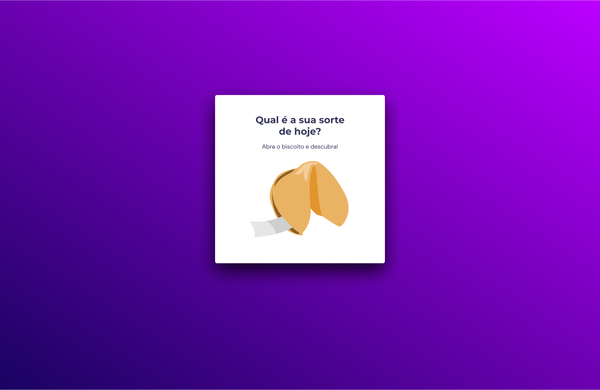
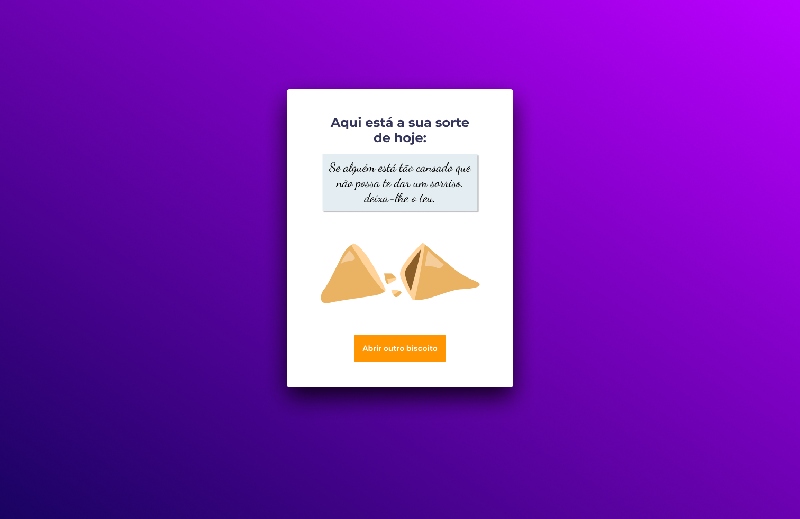

<h1 align="center">Biscoito da Sorte</h1>

  <a href="#projeto">Projeto</a>&nbsp;&nbsp;&nbsp;|&nbsp;&nbsp;&nbsp;
  <a href="#tecnologias">Tecnologias</a>

---

## Projeto

Este é um projeto de gerador de frases de "Biscoito da Sorte", desenvolvido para fornecer frases inspiradoras, motivacionais ou engraçadas aos usuários. O conceito é baseado nos populares biscoitos da sorte encontrados em restaurantes asiáticos, que geralmente contêm uma pequena mensagem ou provérbio dentro deles.

    
    

---

## Tecnologias

Esse projeto foi desenvolvido utilizando as seguintes tecnologias:

- HTML
- CSS
- JavaScript
