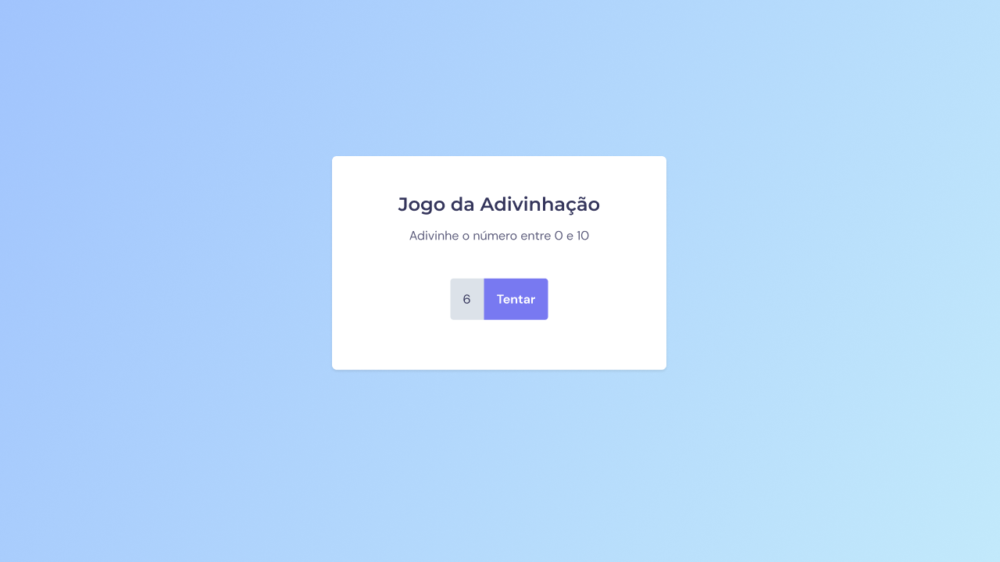
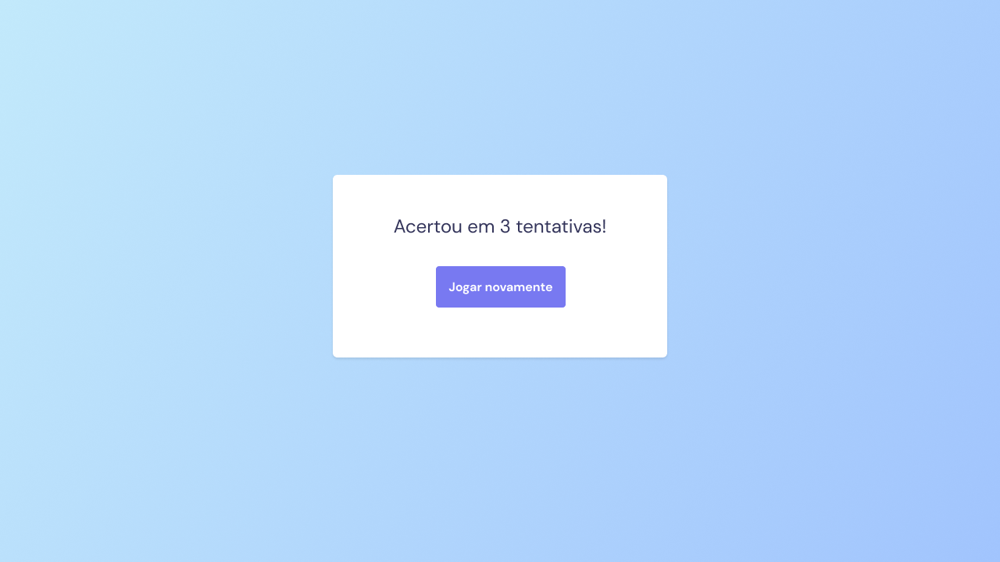

<h1 align="center">Crie seu evento</h1>

  <a href="#projeto">Projeto</a>&nbsp;&nbsp;&nbsp;|&nbsp;&nbsp;&nbsp;
  <a href="#tecnologias">Tecnologias</a>

---

## Projeto

Esta página foi desenvolvida para ser um jogo de adivinhação, foi utilizado a lógica em JavaScript praticada em aulas e ou exercícios anteriores, juntamente com HTML e CSS.

    
    

---

## Tecnologias

Esse projeto foi desenvolvido utilizando as seguintes tecnologias:

- HTML
- CSS
- JavaScript
