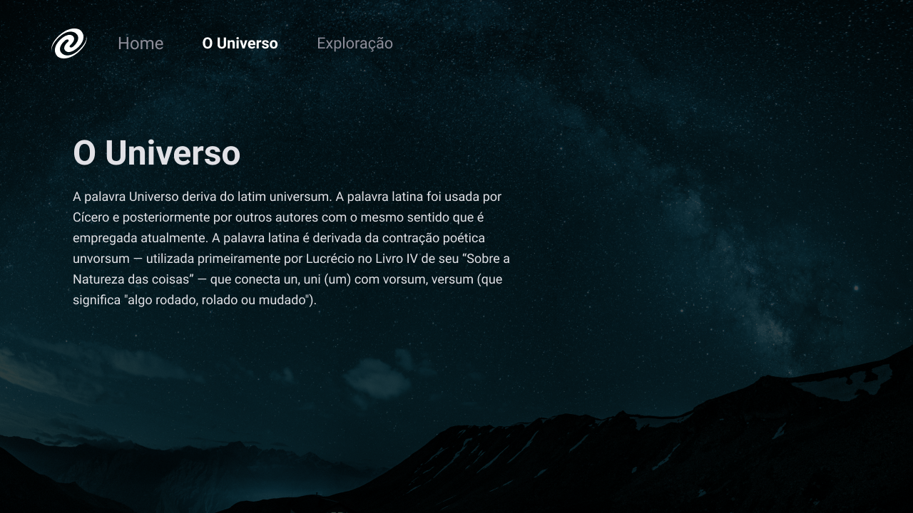

<h1 align="center">SPA Universe</h1>

  <a href="#projeto">Projeto</a>&nbsp;&nbsp;&nbsp;|&nbsp;&nbsp;&nbsp;
  <a href="#requisitos">Requisitos</a>&nbsp;&nbsp;&nbsp;|&nbsp;&nbsp;&nbsp;
  <a href="#tecnologias">Tecnologias</a>

## Projeto

Este é um projeto de Single Page Application (SPA), onde as páginas falam sobre o universo e exploração.

O objetivo dessa SPA é proporcionar uma experiência de navegação suave e interativa, sem a necessidade de recarregar a página a cada interação do usuário.

    
    
    

---

## Requisitos

Para o desenvolvimento, você precisará apenas do Node.js e de um instalador de pacotes Node, o npm, instalados em seu ambiente.

### Node

- #### Instalação do Node no Windows

  Basta acessar o [site oficial do Node.js](https://nodejs.org/) e baixar o instalador.. Além disso, certifique-se de ter o git disponível em seu PATH, pois o npm pode precisar dele (você pode encontrar o git [aqui](https://git-scm.com/)).

- #### Instalação do Node no Windows Ubuntu

  Você pode instalar o nodejs e o npm facilmente com o apt install, basta executar os seguintes comandos.

      $ sudo apt install nodejs
      $ sudo apt install npm

- #### Outros Sistemas Operacionais
  Você pode encontrar mais informações sobre a instalação no [site oficial do Node.js](https://nodejs.org/) e no [site oficial do NPM](https://npmjs.org/).

Se a instalação for bem-sucedida, você deverá ser capaz de executar os seguintes comandos.

    $ node --version
    v8.11.3

    $ npm --version
    6.1.0

---

### Instale as dependências

    $ npm install

### Inicie o projeto

    $ npm start

---

## Tecnologias

Esse projeto foi desenvolvido utilizando as seguintes tecnologias:

- HTML
- CSS
- JavaScript
- Node e NPM
