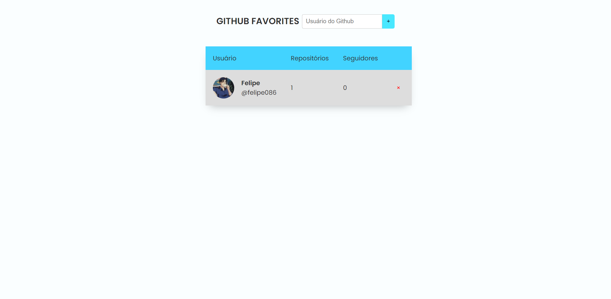

<h1 align="center">Github Favorites</h1>

  <a href="#projeto">Projeto</a>&nbsp;&nbsp;&nbsp;|&nbsp;&nbsp;&nbsp;
  <a href="#requisitos">Requisitos</a>&nbsp;&nbsp;&nbsp;|&nbsp;&nbsp;&nbsp;
  <a href="#tecnologias">Tecnologias</a>

## Projeto

Esta é uma aplicação que utiliza a API do GitHub para buscar dados de usuários e apresentá-los em uma tabela. Através dessa aplicação, o usuário podem pesquisar perfis e favoritar os mesmo, salvando no LocalStorage do navegador.

    

---

## Requisitos

Para iniciar o projeto deve-se utilizar um servidor, um exemplo seria a extensão [Lite Server](https://marketplace.visualstudio.com/items?itemName=ritwickdey.LiveServer), que pode ser instalada no [VSCode](https://code.visualstudio.com/).

---

## Tecnologias

Esse projeto foi desenvolvido utilizando as seguintes tecnologias:

- HTML
- CSS
- JavaScript
